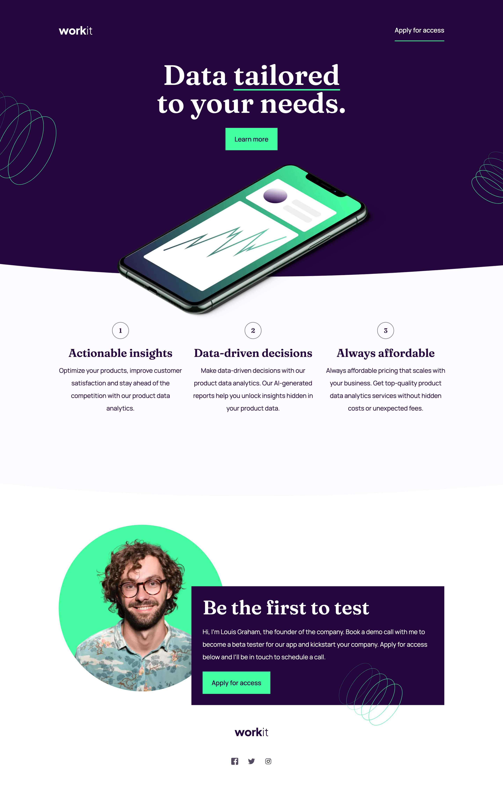

# Frontend Mentor - Workit landing page solution

This is a solution to the [Workit landing page challenge on Frontend Mentor](https://www.frontendmentor.io/challenges/workit-landing-page-2fYnyle5lu). Frontend Mentor challenges help you improve your coding skills by building realistic projects.

## Table of contents

- [Overview](#overview)
  - [The challenge](#the-challenge)
  - [Screenshot](#screenshot)
  - [Links](#links)
- [My process](#my-process)
  - [Built with](#built-with)
  - [What I learned](#what-i-learned)
  - [Useful resources](#useful-resources)
- [Author](#author)

## Overview

### The challenge

Users should be able to:

- View the optimal layout for the interface depending on their device's screen size
- See hover and focus states for all interactive elements on the page

### Screenshot

### Links

- Solution URL: [Github](https://github.com/graficdoctor/fe-24-005-workit-landing-page)
- Live Site URL: [Netlify](https://tangerine-tapioca-d62fea.netlify.app/)

## My process

### Built with

- Semantic HTML5 markup
- CSS custom properties
- Flexbox
- CSS Grid
- Mobile-first workflow

### What I learned

I learned how to do the curves underneath the sections. That did my head in first time I started this exercise. Which seems to be about 6 months ago. I went back to the code this week and had an indepth refactoring, adding in updates to how I currently write my css. Which is by using more utility-classes.
It was interesting to see the development I made in these 6 months.

### Useful resources

- [Custom Shape Dividers](https://www.shapedivider.app/) - The tool I used to create the curved end of the header. I found this tool via the tutorial video for this exercise, by [Practical Web Dev](https://www.youtube.com/watch?v=NkgKIOTgvCI)

## Author

- Website - [Katrien S.](https://www.katriens.be)
- Frontend Mentor - [@graficdoctor](https://www.frontendmentor.io/profile/graficdoctor)
- Twitter - [@graficdoctor](https://www.twitter.com/graficdoctor)
